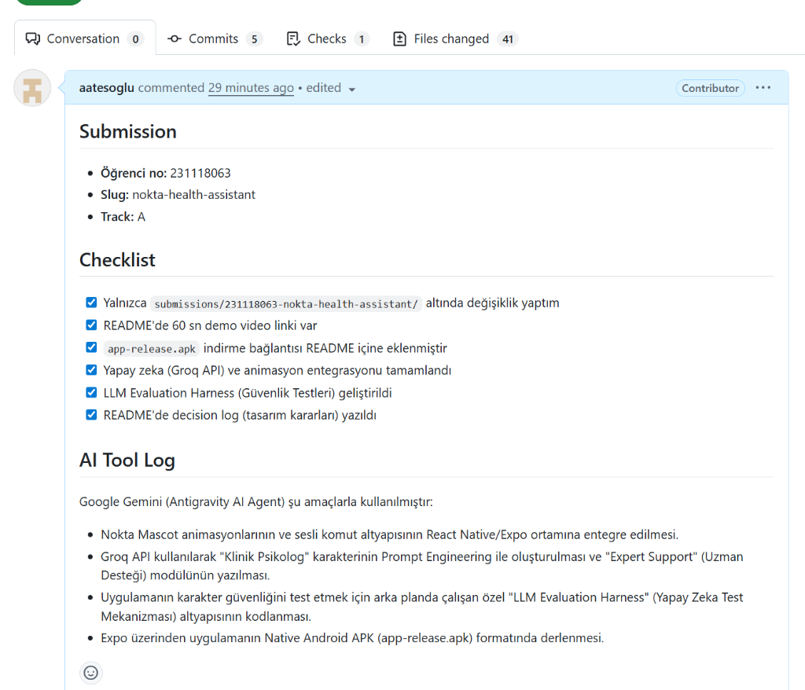

# Audit Raporu — Nokta Health Assistant

**Ekran:** `/index` (Ana Ekran)  
**Tarih:** 14.05.2026 11:38:00  
**Durum:** Çözüldü (SUCCESS)  
**Önem Derecesi:** 🔴 Yüksek

---

### 🔍 Hata Tanımı
Sohbet ekranının alt kısmındaki metin giriş kutusu (TextInput) ve mavi gönder butonu, sanal klavye açıldığında yukarı doğru kaymıyor ve klavyenin altında kalarak görünmez oluyor. Kullanıcı ne yazdığını veya gönder butonunu göremiyor.

### 🛠 Önerilen Çözüm
Ekranın ana bileşeni bir `KeyboardAvoidingView` içerisine alınmalı ve iOS/Android platform farklılıkları gözetilerek `behavior="padding"` (veya `height`) özelliği eklenerek giriş alanının klavye üzerinde kalması sağlanmalı.

### 📸 Görsel İnceleme
*(Kullanıcı tarafından arayüzde işaretlenen giriş alanı aşağıda belirtilmiştir)*

```
+-------------------------------+
|  Nokta - Sağlık Asistanın     |
|                               |
|       [ NOKTA AVATAR ]        |
|                               |
|                               |
|  +-[ SARILI KUTU ALANI ]---+  |
|  | [Mesaj yazın...]  [ 🚀 ] |  |
|  +-------------------------+  |
+-------------------------------+
| [ Q W E R T Y U I O P Ğ Ü ]   |
|  [ A S D F G H J K L Ş İ ]    |
+-------------------------------+
```


