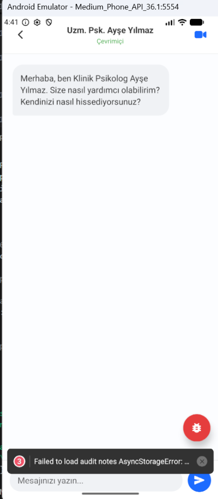

# Audit Raporu — Nokta Health Assistant

**Ekran:** `/expert` (Uzman Sohbet Ekranı)  
**Tarih:** 14.05.2026 11:40:30  
**Durum:** Çözüldü (SUCCESS)  
**Önem Derecesi:** 🟠 Orta

---

### 🔍 Hata Tanımı
Klinik psikolog "Ayşe Yılmaz" ile sohbet ekranında (ExpertScreen), Groq API üzerinden dinamik olarak uzun bir cevap döndüğünde, sohbet ekranı otomatik olarak sayfa sonuna odaklanmıyor. Yazıların akışı ekrandan taşıyor ve son satırları okumak zorlaşıyor.

### 🛠 Önerilen Çözüm
`expert.tsx` dosyasındaki ana ScrollView yapısına bir referans (ref) atanmalı ve her yeni mesaj dizisi yüklendiğinde `setTimeout` içinde animasyonlu `scrollToEnd` tetiklenmelidir.

### 📸 Görsel İnceleme
*(Kullanıcı tarafından işaretlenen uzun metin akış noktası)*

```
+-------------------------------+
|  Uzm. Psk. Ayşe Yılmaz        |
|                               |
|  +-------------------------+  |
|  | Merhaba, anlatın...     |  |
|  +-------------------------+  |
|  | [  Uzun Yanıt Başlar ]  |  |
|  | [  Yanıt Devam Eder  ]  |  |
|  |                         |  |
|  +-[ SARILI KUTU ALANI ]---+  |
|  | [Son kelimeler görünmez]|  |
|  +-------------------------+  |
+-------------------------------+
```


